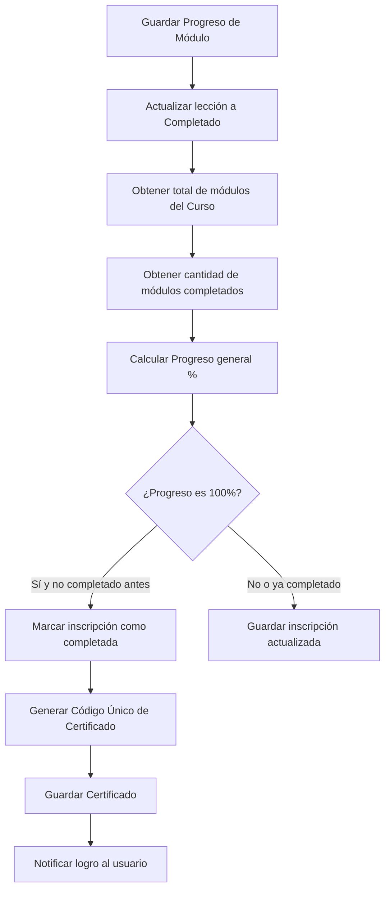

# Rural-Tech API (Backend)

¡Bienvenido al backend de **Rural-Tech**! Esta es una API moderna y de alto rendimiento construida con **FastAPI**, diseñada específicamente para dar soporte a una plataforma de educación rural con capacidades de **sincronización offline** y almacenamiento/autenticación integrados con **Supabase**.

---

## 🚀 Tecnologías Principales

- **Framework:** [FastAPI](https://fastapi.tiangolo.com/) (Asíncrono, basado en Pydantic v2).
- **Gestión de Entorno:** [uv](https://github.com/astral-sh/uv) (Gestor de paquetes extremadamente rápido para Python).
- **Base de Datos:** [PostgreSQL](https://www.postgresql.org/) en Supabase, conectado mediante el motor asíncrono `asyncpg` de SQLAlchemy.
- **Acceso a Datos:** Consultas SQL nativas (Raw SQL) parametrizadas mediante repositorios personalizados para máxima optimización y simplicidad.
- **Autenticación:** Integración con [Supabase Auth](https://supabase.com/docs/guides/auth) mediante validación local y remota de tokens JWT (HS256 y ES256 a través de JWKS).

---

## 📁 Estructura del Directorio

El backend está organizado siguiendo un patrón de arquitectura limpia dividida en capas de responsabilidad:

```text
backend/
├── src/
│   ├── auth/
│   │   └── dependencies.py   # Dependencias de autenticación (JWT y roles)
│   ├── components/
│   │   └── controllers.py    # Controladores y definición de rutas (endpoints)
│   ├── models/
│   │   └── db_models.py      # Declaraciones/modelos (marcado como obsoleto a favor de Raw SQL)
│   ├── repositories/
│   │   └── repositories.py   # Capa de acceso a datos usando SQL crudo y mapeo a RowObject
│   ├── schemas/
│   │   └── schemas.py        # Esquemas de entrada y salida con Pydantic v2
│   ├── services/
│   │   └── services.py       # Capa de lógica de negocio y procesamiento de sincronización
│   ├── config.py             # Configuración del sistema y variables de entorno
│   ├── database.py           # Conexión, motor asíncrono y proveedor de sesión de base de datos
│   └── main.py               # Punto de entrada de la aplicación FastAPI y CORS
├── .env                      # Variables de entorno locales (gitignored)
├── pyproject.toml            # Dependencias del proyecto y configuración de Python
└── uv.lock                   # Archivo de bloqueo de dependencias
```

---

## ⚙️ Configuración e Instalación

### Requisitos Previos
- **Python >= 3.14**
- **uv** (Recomendado) o **pip**

### Paso 1: Configurar Variables de Entorno
Crea un archivo `.env` en la raíz del directorio `backend/` basado en la siguiente configuración:

```env
DATABASE_URL=postgresql+asyncpg://postgres:[contraseña]@[host]:5432/postgres
SUPABASE_JWT_SECRET=tu-supabase-jwt-secret-para-tokens-HS256
SUPABASE_URL=https://[tu-proyecto].supabase.co
SUPABASE_ANON_KEY=tu-supabase-anon-key
ADMIN_REGISTRATION_SECRET=RuralTechAdmin2026!
```

> [!NOTE]
> Puedes obtener el `SUPABASE_JWT_SECRET` en tu panel de Supabase: *Settings -> API -> JWT Settings -> JWT Secret*.

### Paso 2: Instalar Dependencias
Si estás utilizando `uv`, las dependencias se instalarán automáticamente al arrancar. También puedes instalarlas manualmente:

```bash
uv sync
```

Si prefieres usar `pip` estándar:
```bash
pip install -r pyproject.toml
```

### Paso 3: Ejecutar el Servidor de Desarrollo
Para arrancar el backend con recarga automática:

```bash
uv run uvicorn src.main:app --reload --host 127.0.0.1 --port 8000
```

El servidor estará disponible en `http://127.0.0.1:8000`. Puedes consultar la documentación interactiva e interactuar con los endpoints (Swagger UI) en `http://127.0.0.1:8000/docs`.

---

## 🔒 Autenticación y Autorización

El backend delega la autenticación a **Supabase Auth** pero realiza la validación de manera local y ágil en `src/auth/dependencies.py`:
1. **Validación JWT:** El backend intercepta los tokens enviados en la cabecera `Authorization: Bearer <token>`.
2. **Soporte Algoritmos:** Admite firmas `HS256` (usando el secreto compartido) y `ES256` (consultando dinámicamente las claves públicas JWKS de Supabase desde `SUPABASE_URL/auth/v1/.well-known/jwks.json`).
3. **Autocreación de Perfil:** Cuando un usuario autenticado por primera vez realiza una petición a la API, el backend extrae sus metadatos del token (email, nombre, rol, ubicación) y crea automáticamente su registro en la tabla `perfiles` local.
4. **Control de Roles:** La dependencia `get_current_admin_id` restringe operaciones críticas de administración únicamente a aquellos usuarios con el rol `administrador`.

---

## 📦 Capas de la Arquitectura

### 1. Controladores (`src/components/controllers.py`)
Mapea los endpoints HTTP y se comunica con la capa de servicios o repositorios según corresponda. Maneja la conversión de payloads a esquemas Pydantic y el retorno de respuestas HTTP.

### 2. Servicios (`src/services/services.py`)
Encapsula la lógica de negocio del negocio educativo rural.
- Coordina la lógica de inscripción.
- Calcula el avance general del estudiante al completar lecciones.
- Dispara notificaciones en tiempo real al usuario.
- Genera automáticamente certificados cuando el progreso alcanza el 100%.

### 3. Repositorios (`src/repositories/repositories.py`)
Implementa el patrón repositorio para desacoplar el acceso a la base de datos de la lógica de negocio. Utiliza sentencias SQL nativas y mapea las tuplas resultantes a una clase utilitaria llamada `RowObject`, la cual permite leer las columnas como propiedades del objeto (e.g. `perfil.nombre`).

### 4. Esquemas Pydantic (`src/schemas/schemas.py`)
Define la estructura esperada para recibir datos y responder al cliente, garantizando la validación de tipos, formatos de email y conversión de UUIDs.

---

## 🔄 Sincronización Offline (Offline Sync)

Una de las características clave de **Rural-Tech** es la resiliencia en zonas con baja o nula conectividad a internet. 

El backend expone un endpoint `/api/sincronizacion/sync` que recibe una lista de acciones que el usuario realizó en local mientras estaba offline:
- **`COMPLETE_LESSON`**: Registra que el estudiante leyó/completó un módulo.
- **`SUBMIT_ASSESSMENT`**: Envía el puntaje obtenido por el estudiante en una evaluación offline.
- **`ENROLL_COURSE`**: Inscribe al estudiante a un nuevo curso descargado.

El backend ejecuta estas tareas secuencialmente, recalculando el progreso global, creando certificados si el curso se completó y disparando una notificación final indicando cuántas acciones se sincronizaron con éxito.

---

## 🔌 API Endpoints (Resumen)

### Autenticación (`/api/auth`)
*   `POST /api/auth/register`: Registra un estudiante llamando internamente al endpoint administrativo de Supabase.
*   `POST /api/auth/register-admin`: Registra un administrador. Requiere pasar el secreto `ADMIN_REGISTRATION_SECRET`.

### Cursos (`/api/cursos`)
*   `GET /api/cursos/`: Obtiene todos los cursos disponibles. Los administradores pueden pasar el parámetro `all=true` para listar también los ocultos.
*   `GET /api/cursos/{curso_id}`: Obtiene el detalle de un curso con su listado de módulos ordenados.
*   `POST /api/cursos/` *(Sólo Admin)*: Crea un nuevo curso y notifica a todos los usuarios.
*   `PUT /api/cursos/{curso_id}` *(Sólo Admin)*: Actualiza un curso existente.
*   `DELETE /api/cursos/{curso_id}` *(Sólo Admin)*: Elimina un curso.
*   `POST /api/cursos/{curso_id}/modulos` *(Sólo Admin)*: Añade un módulo a un curso.
*   `PUT /api/cursos/{curso_id}/modulos/{modulo_id}` *(Sólo Admin)*: Actualiza un módulo.
*   `DELETE /api/cursos/{curso_id}/modulos/{modulo_id}` *(Sólo Admin)*: Elimina un módulo.

### Inscripciones (`/api/inscripciones`)
*   `POST /api/inscripciones/inscribir`: Inscribe al usuario actual en un curso.
*   `DELETE /api/inscripciones/desinscribir/{curso_id}`: Cancela la inscripción.
*   `GET /api/inscripciones/mis-cursos`: Obtiene la lista de inscripciones del usuario actual.
*   `GET /api/inscripciones/mis-cursos/detalle`: Obtiene las inscripciones cargando en la misma respuesta la información completa del curso.
*   `GET /api/inscripciones/progreso-lecciones`: Obtiene el registro detallado de módulos completados y sus puntajes.
*   `POST /api/inscripciones/progreso-leccion`: Guarda o actualiza el progreso en un módulo específico.

### Certificados (`/api/certificados`)
*   `GET /api/certificados/`: Obtiene los certificados obtenidos por el usuario.
*   `GET /api/certificados/descargar/{codigo_certificado}`: Descarga una versión imprimible en texto plano del certificado verificado.

### Notificaciones (`/api/notificaciones`)
*   `GET /api/notificaciones/`: Recupera las notificaciones del usuario ordenadas de más reciente a más antigua.
*   `PUT /api/notificaciones/{notif_id}/leer`: Marca una notificación como leída.
*   `DELETE /api/notificaciones/{notif_id}`: Elimina una notificación.

### Sincronización (`/api/sincronizacion`)
*   `POST /api/sincronizacion/sync`: Sincroniza en lote la cola de acciones offline.

---

## 📈 Lógica de Completado y Certificación


